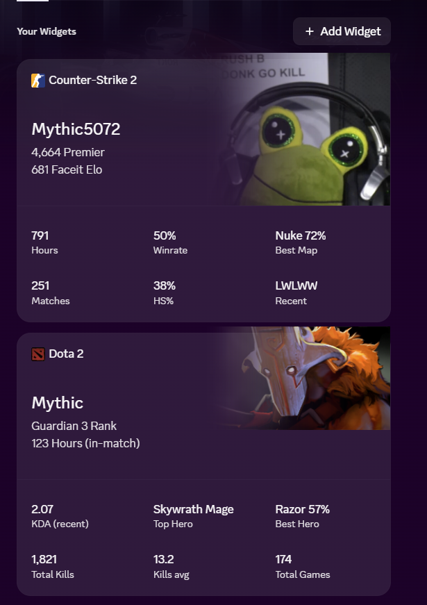

# Widget bot

Uses Discord Widgets to display game statistics. Currently supports Counter-Strike (Faceit and Premier), Dota 2, and Deadlock.

## Commands

| Command | What it does |
|---|---|
| `/widget setup` | Authorization link + getting started |
| `/widget link game account [service]` | Link a game account (validates it immediately). For Counter-Strike, `service` picks Faceit vs Steam; without it the bot guesses from the account format |
| `/widget show game` | Pick which linked game the widget displays |
| `/widget refresh` | Push fresh stats to the widget now |
| `/widget status` | List linked accounts |

## API keys

- **Faceit** - [developers.faceit.com](https://developers.faceit.com), App Studio, create server-side key.
- **Steam** - [steamcommunity.com/dev/apikey](https://steamcommunity.com/dev/apikey). Enables the Hours stat on all Valve games and user profile pictures.
- **Leetify** - optional: [leetify.com/app/developer](https://leetify.com/app/developer). Used only as the data source for Premier rating; requires a Leetify profile.
- OpenDota and deadlock-api.com currently does not require API keys.

## Notes

- Account links live locally in `data/store.json`. No stats are stored or shared remotely.
- Deadlock has no official API as the game is in Alpha. Valve can cut off access from deadlock-api.com at any point.
- Discord Widget developer access is in a constantly changing state, there is a possibility Discord can render part or all of this project obselete and unusable at any point.
